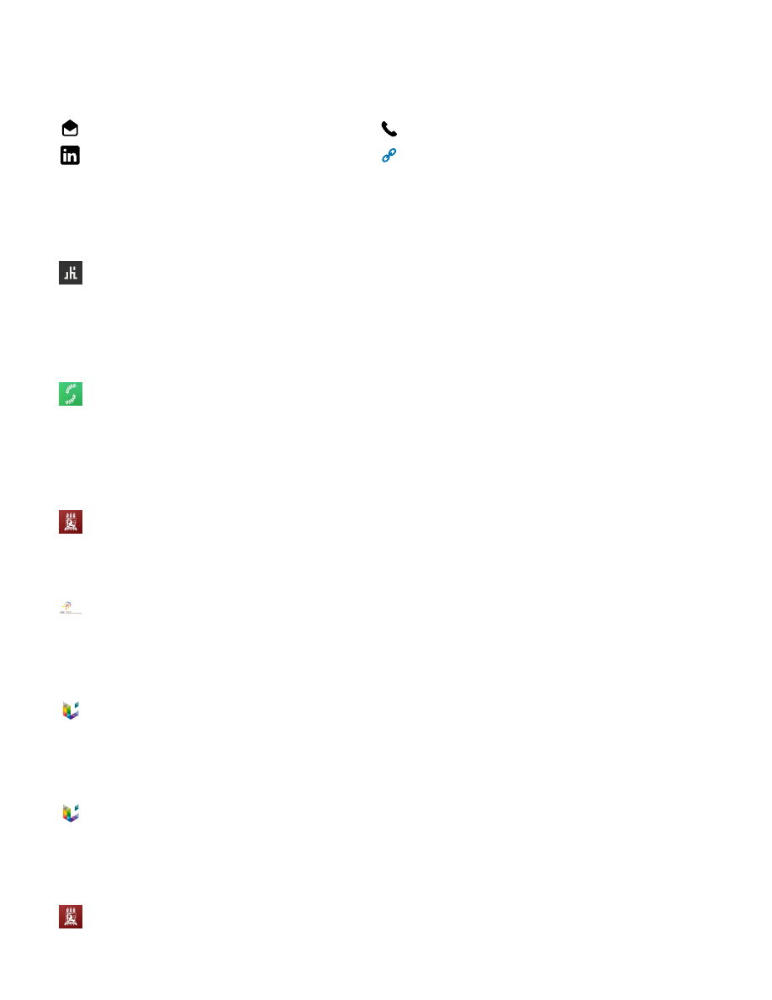
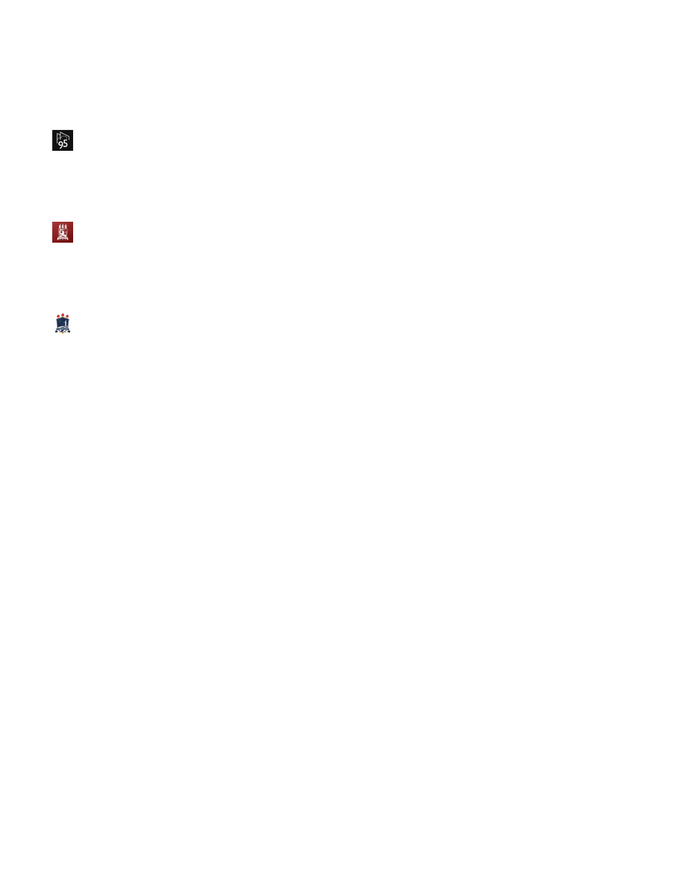

::: {#page1-div style="position:relative;width:918px;height:1188px;"}
{width="918"
height="1188"}

Gabriel Barros

gabrieldelc.barros@gmail.com

+5581996007418

[linkedin.com/in/gabriel-del](https://www.linkedin.com/in/gabriel-del)

<https://github.com/gabriel-del>

**Summary**

Full-Stack developer very experienced using linux and Next.js

**Experience**

**Software Engineer**

Kindelia Foundation

Apr 2022 - Oct 2022 (7 months)

Front-end developer using Next.js, tailwindcss, turborepo etc.

Functional programer on language Kind.

**Software Engineer**

Salvus

Aug 2019 - Jan 2020 (6 months)

I developed script to auto calibrate IoT flowmeter using bash, octave,
AWK and C.

**Education**

**Universidade Federal de Pernambuco**

Bachelor\'s degree, Engenharia Biomédica/Médica

2015 - 2021

**Polytechnic Institute of Setúbal**

student exchange, Biomedical/Medical Engineering

Sep 2018 - Feb 2019

student exchange

**University of Liège**

student exchange, Biomedical/Medical Engineering

Sep 2016 - Mar 2017

student exchange

**University of Liège**

student exchange, French Language and Literature

Oct 2016 - Dec 2016

Cours de français langue étrangère

**Universidade Federal de Pernambuco**

scientific research, Mathematics

Gabriel Barros - page 1
:::

::: {#page2-div style="position:relative;width:918px;height:1188px;"}
{width="918"
height="1188"}

Feb 2015 - Jun 2016

scientific research offered by the mathemathics olympics

PICME (Programa de iniciação científica em Matemática)

**Universidade Federal de Minas Gerais**

Summer course, Mathematics

Jan 2016 - Feb 2016

Course offered by the mathematics olympics

**Universidade Federal de Pernambuco**

Middle School Diploma, Basic School

Feb 2008 - Dec 2014

Basic School

**Universidade Federal Rural de Pernambuco**

scientific research, Mathematics

Aug 2009 - Dec 2012

scientific research offered by the mathemathics olympics

PICME (Programa de iniciação científica em Matemática)

**Skills**

Linux   •   Next.js   •   Brazilian Portuguese   •   Portuguese   •  
Open-Source Software   •   Higher Education   •  

Data Analysis   •   Image Processing   •   Digital Image Processing   •
  Machine Learning

Gabriel Barros - page 2
:::
